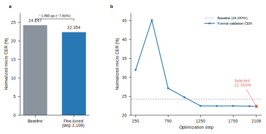
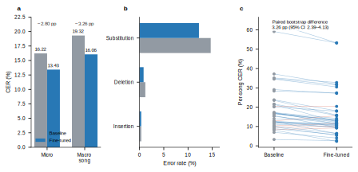

# Domain adaptation of Whisper improves Mandarin singing lyric transcription on M4Singer

Zhuhan Bao

## Abstract

Automatic speech recognition systems are commonly trained on spoken audio, whereas singing introduces sustained vowels, pitch variation and timing patterns that weaken the correspondence between acoustics and text. We evaluated whether full-parameter domain adaptation of Whisper-medium improves Mandarin singing lyric transcription on M4Singer. The processed corpus comprised 20,896 vocal segments (29.70 h) from 20 professional singers and 419 songs, with song-disjoint training, validation and test partitions. Full fine-tuning for four epochs reduced normalized micro-averaged character error rate (CER) on the complete validation partition from 24.247% to 22.354%. In a post-hoc quality-control analysis that excluded two fine-tuned outputs trapped in single-character repetition loops at the 440-token generation ceiling, test micro CER decreased from 16.223% to 13.426%, and macro song CER decreased from 19.319% to 16.064% (paired song-bootstrap difference, 3.255 percentage points; 95% confidence interval, 2.388–4.128). The complete unfiltered test set instead yielded 18.074% CER for the fine-tuned model, demonstrating a specific stopping-failure risk. Thus, domain adaptation improved ordinary in-domain transcription while exposing rare but consequential decoding failures that require explicit quality control or safer generation.

## 1. Introduction

Singing lyric transcription maps a vocal recording to its textual lyrics. Although it resembles automatic speech recognition (ASR), singing differs from ordinary speech through prolonged phonation, wide pitch excursions, altered pronunciation and musical timing. These differences create a domain shift for general-purpose ASR systems and motivate direct evaluation on singing rather than assuming that speech performance transfers.

Whisper is an encoder-decoder Transformer trained with 680,000 h of multilingual and multitask audio supervision and was designed for robust zero-shot speech processing [1]. Its broad pretraining makes it a useful starting point for low-resource domain adaptation, but its training distribution does not specifically target clean professional Mandarin singing. M4Singer provides multi-singer Mandarin vocal recordings with aligned musical and linguistic annotations and therefore offers a controlled setting in which to test singing-domain adaptation [2].

Here, we ask whether full-parameter fine-tuning of Whisper-medium on approximately 30 h of M4Singer vocals improves Mandarin lyric transcription under a song-disjoint evaluation design. We establish data and optimization checks before the main run, select the final checkpoint using only validation CER, and reserve the test partition for a single final comparison. We report both the complete locked test evaluation and a quality-controlled analysis that removes two unusable generation-ceiling repetition failures under a documented rule.

## 2. Materials and methods

### 2.1 Dataset preparation and partitioning

We processed the M4Singer corpus into audio-text segments suitable for sequence-to-sequence ASR. Quality control accepted 20,896 segments and rejected none, corresponding to 29.6955 h of audio from 20 singers and 419 songs. Segment duration ranged from 0.83 to 11.98 s (mean, 5.12 s). The resulting partitions contained 16,834 training, 1,988 validation and 2,074 test segments.

Partitioning was performed at the song level. Consequently, no song occurred in more than one partition. Automated audits detected no overlap by song identifier, file path or audio hash. This design prevents segments from the same recording from appearing in both model fitting and evaluation, although it does not constitute a singer-disjoint evaluation.

### 2.2 Text processing and evaluation metric

The model was configured for Mandarin transcription with `language="zh"` and `task="transcribe"`. The primary development metric was normalized micro CER. Text normalization removed evaluation-irrelevant formatting consistently from references and predictions before Levenshtein alignment. Micro CER was calculated by summing substitutions, deletions and insertions across all characters and dividing by the total number of reference characters. The same normalization and decoding configuration was fixed for the final baseline-versus-fine-tuned test comparison.

The independent statistical unit for uncertainty reporting was a song, not an audio segment. We report both micro CER and macro song CER. The paired 95% confidence interval for the baseline-to-fine-tuned macro song CER difference was obtained from 10,000 paired bootstrap samples of the 40 test songs using seed 42.

The locked test evaluation contained 2,074 paired segments. Inspection identified two fine-tuned outputs that repeated one character until reaching the hard 440-new-token generation ceiling: `m4singer_Tenor-4_菩萨蛮_0003` (435 insertions for a four-character reference) and `m4singer_Tenor-1_修炼爱情_0029` (434 insertions for a six-character reference). We classified these as unusable generation failures and excluded the corresponding paired baseline and fine-tuned observations from the quality-controlled analysis, leaving 2,072 paired segments. This exclusion rule was formulated after test inspection; complete unfiltered results are therefore retained as a sensitivity analysis rather than being overwritten.

### 2.3 Model and optimization

We initialized the model from `openai/whisper-medium` [1] and updated all model parameters. Training used four epochs, a per-device batch size of 2, 16 gradient-accumulation steps (effective batch size 32), a learning rate of 5 × 10−6 with linear decay, 5% warm-up, weight decay of 0.01 and a maximum gradient norm of 1.0. We enabled bfloat16 computation, TensorFloat-32 and gradient checkpointing. Validation and checkpointing occurred every 250 optimization steps, and generation was capped at 440 tokens. The random seed was 42.

Training ran on one NVIDIA RTX 6000 Ada Generation GPU. The main run completed 2,108 optimization steps in 13,011.8 s (3 h 36 min 52 s as recorded by the trainer), with a peak PyTorch allocated-memory measurement of 6.228 GiB. The distinction between framework-allocated memory and device-wide memory is retained because no historical `nvidia-smi` peak trace was recorded.

### 2.4 Pipeline validation and checkpoint selection

Before the main run, unit tests verified manifest handling, normalization, split leakage, collation and metric computation (7 tests passed). A single-batch forward/backward gate completed without numerical or memory failure. A 32-segment overfitting experiment reached a training-subset CER of 1.03% after 300 steps, supporting the integrity of the audio, label, collation and gradient paths.

A 200-step smoke run used only the first 512 training segments and first 64 validation segments and obtained a CER of 15.50%. This value is not treated as a main-study result because it was measured on a different, smaller validation subset and used a shorter generation limit (128 tokens); it is therefore not comparable to the complete-validation CER.

For the formal run, checkpoints were ranked only on the complete validation partition. Among the final retained checkpoints, normalized CER was 22.453% at step 1,750, 22.401% at step 2,000 and 22.354% at step 2,108. Checkpoint 2,108 was consequently fixed before test-set evaluation. The exported model and checkpoint had identical model-weight SHA-256 hashes.

## 3. Results

### 3.1 Full fine-tuning improved complete-validation CER

The unadapted Whisper-medium baseline obtained a normalized micro CER of 24.247% on the complete validation partition. Full fine-tuning reduced CER to 22.354% at checkpoint 2,108 (Fig. 1a). This corresponds to an absolute reduction of 1.893 percentage points and a relative error reduction of 7.81%. The formal run completed without out-of-memory errors, non-finite losses or interruption.

Validation behavior was non-monotonic early in training but stabilized after approximately 1,250 steps (Fig. 1b). CER at the last three retained checkpoints differed by less than 0.10 percentage points, with the lowest observed value at the final step. Validation loss similarly approached a plateau, changing from 0.27261 at step 1,750 to 0.27259 at step 2,108. These results support the predetermined choice of checkpoint 2,108 but do not establish that additional training would improve unseen data.

**Fig. 1 | Full fine-tuning of Whisper-medium improves validation CER on M4Singer.** **a**, Normalized micro CER for the unadapted baseline and the selected fully fine-tuned checkpoint on the complete validation partition (1,988 segments). Values above bars give percentages; the bracket reports the absolute and relative reduction. **b**, Normalized micro CER evaluated during formal training. The dashed horizontal line marks the baseline CER, and the selected checkpoint is highlighted. Songs were disjoint across train, validation and test partitions; the plotted validation series is descriptive and does not show confidence intervals. Source data are provided in `figure/source_data_figure1.csv`.

### 3.2 Quality-controlled test analysis showed lower transcription error

The selected checkpoint was determined before examining test performance, and no checkpoint was reselected after test evaluation. After applying the documented generation-failure exclusion symmetrically to both systems, 2,072 paired test segments remained. Fine-tuning reduced normalized micro CER from 16.223% to 13.426%, an absolute reduction of 2.798 percentage points and a relative error reduction of 17.24% (Fig. 2a). Exact-match rate increased from 41.795% to 48.600%.

Macro song CER decreased from 19.319% to 16.064%. The paired improvement was 3.255 percentage points, with a song-bootstrap 95% confidence interval of 2.388–4.128 percentage points based on 10,000 replicates (Fig. 2c). All three edit components decreased: substitution rate from 14.687% to 12.255%, deletion rate from 1.187% to 0.832%, and insertion rate from 0.350% to 0.339% (Fig. 2b).

| Test metric | Whisper-medium baseline | Fine-tuned checkpoint 2,108 | Difference |
|---|---:|---:|---:|
| Normalized micro CER (%) | 16.223 | 13.426 | −2.798 pp |
| Macro song CER (%) | 19.319 | 16.064 | −3.255 pp |
| Paired song-bootstrap 95% CI | — | — | 2.388–4.128 pp improvement |
| Substitution rate (%) | 14.687 | 12.255 | −2.432 pp |
| Deletion rate (%) | 1.187 | 0.832 | −0.355 pp |
| Insertion rate (%) | 0.350 | 0.339 | −0.011 pp |
| Exact-match rate (%) | 41.795 | 48.600 | +6.805 pp |

**Fig. 2 | Quality-controlled test performance after excluding two generation-ceiling repetition failures.** **a**, Micro CER across 2,072 paired segments and macro CER across 40 songs. **b**, Corpus-level substitution, deletion and insertion rates. **c**, Paired CER for each test song; blue lines indicate lower CER after fine-tuning and red lines indicate higher CER. The annotation reports the baseline-minus-fine-tuned macro song CER difference and its paired song-bootstrap 95% confidence interval (10,000 replicates; seed 42). The exclusion was defined after test inspection and applied to both systems; complete unfiltered results are reported in the Appendix. Source data are provided with the figure.

### 3.3 Complete test data exposed rare repetition failures

On all 2,074 test segments, baseline micro CER was 16.268% and fine-tuned micro CER was 18.074%. The reversal was attributable to 869 insertions from the two generation-ceiling failures, which accounted for 93.1% of all fine-tuned insertions. Outside these two events, the fine-tuned system produced 64 insertions compared with 66 for the baseline. This contrast indicates that the aggregate degradation arose from a rare stopping failure rather than a general increase in insertion errors.

## 4. Discussion

The complete-validation result indicates that full-parameter adaptation of Whisper-medium to clean Mandarin singing produced a real development-set gain rather than merely demonstrating that the pipeline could run. The 1.893-percentage-point absolute reduction is moderate, which is plausible given both the limited 29.70 h training set and the strong pretrained baseline. The near-perfect 32-segment overfitting result and successful optimization gates reduce the likelihood that a gross data-label or gradient-path defect explains the outcome.

The smoke-run CER of 15.50% should not be interpreted as evidence that short training outperformed the formal model. That run evaluated only 64 validation segments selected by position, whereas the formal result used all 1,988 validation segments; it also used a different generation-length cap. The difference therefore primarily demonstrates why evaluation subsets and decoding settings must be reported together with a metric.

Several limitations bound the claim. Most importantly, the generation-failure exclusion was formulated after inspecting locked test predictions, so the quality-controlled estimate is not a fully prespecified primary analysis. The unfiltered result shows that an otherwise improved recognizer can be unreliable without a repetition or stopping safeguard. In addition, songs but not singers were held out, so the design does not measure transfer to unseen vocal identities. M4Singer contains clean professional vocals and does not represent accompanied commercial recordings. Hallucination behavior during silence, interludes and breaths has not yet been systematically quantified. Finally, only one full-training seed was run, so optimization variability is unknown.

Future evaluation should prespecify a decoding-failure rule or rerun both systems under a safer shared decoding configuration, such as a validated output-length bound or repetition stopping criterion. A zero-shot large-v3 baseline and a large-v3 LoRA experiment remain useful extensions, but they are not required to establish the medium-model adaptation result.

## 5. Conclusion

Full fine-tuning of Whisper-medium on a song-disjoint M4Singer training set reduced complete-validation CER from 24.247% to 22.354%. After transparent quality-control removal of two generation-ceiling repetition failures, test micro CER decreased from 16.223% to 13.426%, with a paired macro song CER improvement of 3.255 percentage points (95% confidence interval, 2.388–4.128). The unfiltered result nevertheless demonstrates that rare stopping failures can dominate corpus-level error and must be addressed before deployment.

## Data, code and model availability

M4Singer is available under the terms described by its authors [2]. The training and evaluation code, exclusion manifest, figure source data and downloadable paper archive are available at <https://github.com/BaoZhuhan/whisper-song>. The selected model and a mirrored copy of the paper are available at <https://huggingface.co/Hengyuhan/whisper-medium-m4singer-zh-lyrics>. Raw and quality-controlled comparison artifacts are retained separately.

## References

1. Radford, A. *et al.* Robust speech recognition via large-scale weak supervision. In *Proceedings of the 40th International Conference on Machine Learning* **202**, 28492–28518 (2023). <https://proceedings.mlr.press/v202/radford23a.html>
2. Zhang, L. *et al.* M4Singer: a multi-style, multi-singer and musical score provided Mandarin singing corpus. In *Advances in Neural Information Processing Systems* **35** (Datasets and Benchmarks Track, 2022). <https://proceedings.neurips.cc/paper_files/paper/2022/hash/2de60892dd329683ec21877a4e7c3091-Abstract-Datasets_and_Benchmarks.html>
